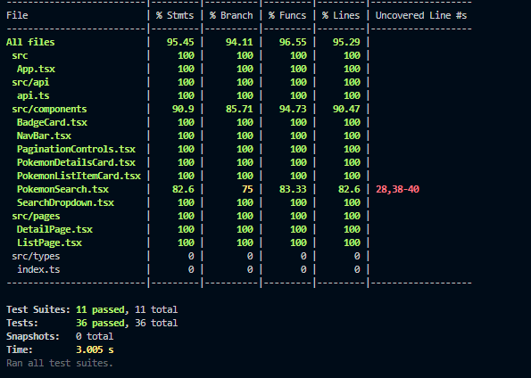
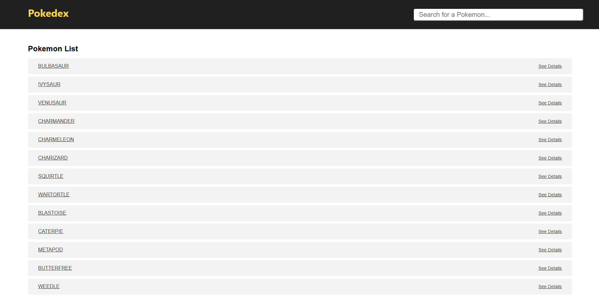
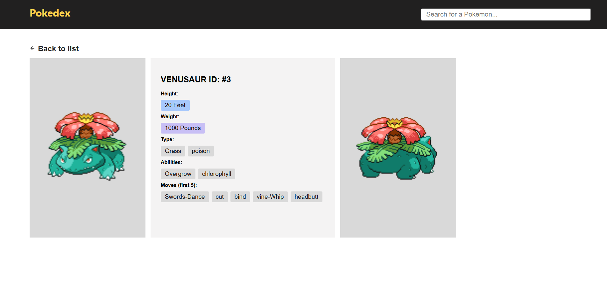
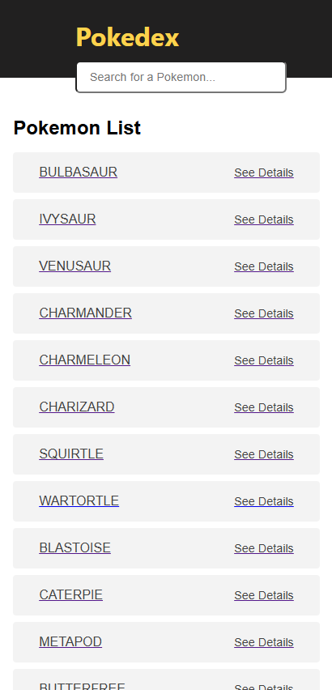
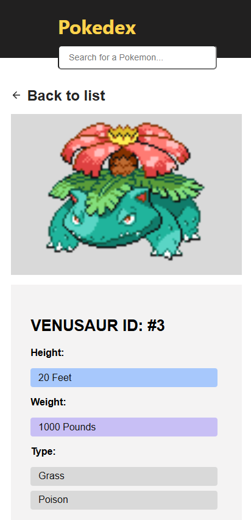
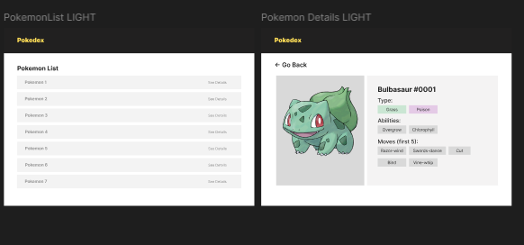

# Pokémon Pokedex App Livefront Challenge 

This is a simple React and TypeScript application that uses the [PokeAPI](https://pokeapi.co/) to display a list of Pokemon and their details.

---

## Getting Started
After cloning the repo go into the root project directory then install dependencies.
### 1. Install Dependencies

```bash
npm install
```
In the project directory, you can run:

### 2. Running the Project

```bash
npm start
```
Runs the app in the development mode.\
Open [http://localhost:3000](http://localhost:3000) to view it in the browser.

The page will reload if you make edits.\
You will also see any lint errors in the console.

### 3. Running the tests

```bash
npm test
```
Launches the test runner in the interactive watch mode.\
See the section about [running tests](https://facebook.github.io/create-react-app/docs/running-tests) for more information.

or if you want to run it with coverage:

```bash
npm test -- --coverage --watchAll
```
### Test results:



## Screenshots
Screenshots on different devices for each page:

### Desktop






### Mobile





## Initial Mockup

You can view the Figma design here:  
[Figma Link](https://www.figma.com/design/wVZ6lQ80NsE20vtG5B2rdx/Livefront-Coding-Project?node-id=0-1&t=QkYBdGNpvpGXvEqZ-1)


